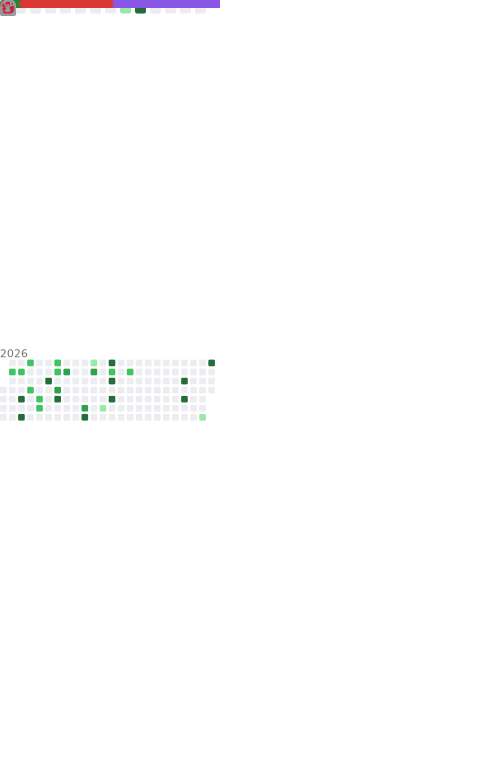

 

<a href="https://next.ossinsight.io/widgets/official/compose-user-dashboard-stats?user_id=66541860" target="_blank">
  <picture>
    <source media="(prefers-color-scheme: dark)" srcset="https://next.ossinsight.io/widgets/official/compose-user-dashboard-stats/thumbnail.png?user_id=66541860&image_size=auto&color_scheme=dark">
    
  </picture>
</a>

 

 

## 🌟 I'm **Xytpz**
- 🐍 Amateur Python Programmer.
- 🔧 Working in Shandong, China.
- 🤖 Passionate about Developing [NovelAI Auto Script](https://github.com/zhulinyv/Auto-NovelAI-Refactor) related Projects.
- ✏️ Learning Python/C#/JavaScript/Java/SQL/Linux etc.

## 📖 **Learning**

- [Python](https://www.python.org/) - A programming language that lets you work more quickly and integrate your systems more effectively.
- [Linux](https://www.linux.org/) - A family of open-source Unix-like operating systems based on the Linux kernel.
- [JavaScript](https://www.javascript.com/) - A lightweight, interpreted, or just-in-time compiled programming language with first-class functions.
- [Auto-NovelAI-Refactor](https://github.com/zhulinyv/Auto-NovelAI-Refactor) - A NovelAI Auto Script Refactor Project.
- [Semi-Auto-NovelAI-to-Pixiv](https://github.com/zhulinyv/Semi-Auto-NovelAI-to-Pixiv) - A NovelAI Auto Script Project.
- [NoneBot2](https://github.com/nonebot/nonebot2) - A Python asynchronous cross-platform chatbot framework.
- Plugins for NoneBot2, Auto-NovelAI-Refactor, Semi-Auto-NovelAI-to-Pixiv etc.

## 🌍 **Environment**

## 🎮 Playing **Games**

- Wuthering Waves
- Honor of Kings
- Azur lane
- Naraka: Bladepoint
- PUBG
- Forza Horizon
- ...

