# Hi there 👋

  

  </img>
  </img>

## 🌟 I'm **(๑•小丫头片子•๑)**

- 👨🏻‍🎓A Chinese Student
- 🐠Touch fish~
- 🐤Just a Rookie
- 🤖Developing a [NovelAI script](https://github.com/zhulinyv/Semi-Auto-NovelAI-to-Pixiv)

## 📖 **Learning**

## 🌍 **Environment**

## 🎮 Playing **Games**

- Genshin Impact
- Forza Horizon
- Azure Lane
- Snowbreak: Containment Zone
- Wuthering Waves
- ...

## 🎮 My **Genshin** Info

